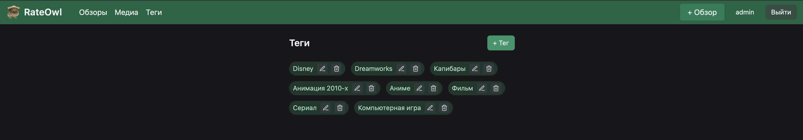
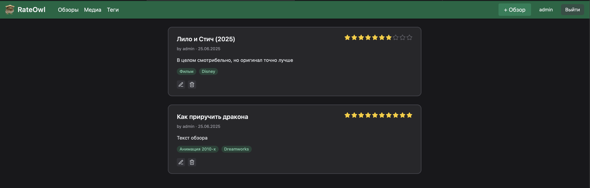

Вот обновлённая версия README.md с чуть более официальным тоном, но всё ещё живой и доступной подачей:

⸻


# 🦉 RateOwl

**RateOwl** — это веб-приложение для создания и просмотра обзоров на любые виды медиа: фильмы, сериалы, видеоигры и не только. Сервис позволяет пользователям делиться впечатлениями, оценивать контент и организовывать обзоры с помощью тегов.

## ⚙️ Технологический стек

- **Backend**: [FastAPI](https://fastapi.tiangolo.com/)
- **База данных**: PostgreSQL
- **Контейнеризация**: Docker
- **Миграции**: Alembic
- **Frontend**: React (интерфейс создан с использованием ChatGPT)

## 🧩 Основной функционал

- Создание и редактирование обзоров
- Присвоение тегов для удобной навигации
- Система оценок (звёзды)
- Управление тегами через административный интерфейс
- Авторизация пользователей

## 🖼️ Интерфейс

| Управление тегами        | Список обзоров                |
|--------------------------|-------------------------------|
|  |  |


## 🚀 Запуск

```bash
git clone https://github.com/your-username/RateOwl.git
cd RateOwl
docker compose up -d
```

📝 Дополнительно
	•	Frontend реализован с помощью React и сгенерирован на основе описания через GPT.
	•	В будущем планируется расширение функциональности (например, комментирование, сортировка по популярности и т.п.).


## Функционал, находящийся в работе:
- Удаление и редактирование всех моделей
- Полноценные конфиги
- Скрытие обзоров от остальных пользователей
- Сортировка обзоров по тегам и другим параметрам
- Фото в медиа и обзорах
- График со статистикой оценок
- Рекомендации от нейросети на основе оценок

## Известные баги и недоработки:
- Не самая оптимальная структура команд
- Неоптимальный Dockerfile
- Необходимость импорта моделей в alembic